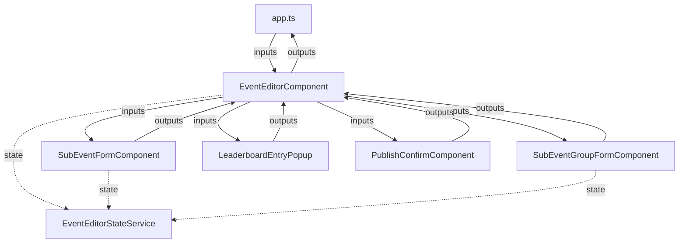

# Event Editor Extraction Plan

## Overview
Extract the event editor functionality from [`app.ts`](src/app/app.ts) (684KB) into a modular Angular component structure in the [`src/app/event-editor`](src/app/event-editor) directory.

## Current State Analysis

### In app.ts (~114 method references)
- **Properties**: `eventEditorMode`, `eventEditorReadOnly`, `eventEditorTarget`, `eventForm`, `showSubEventForm`, `showSubEventGroupForm`, `eventEditorClosePublishConfirmContext`, etc.
- **Methods**: `openEventEditor()`, `saveEventEditorForm()`, `cancelEventEditorForm()`, `prepareEventEditorForm()`, `onSubEventCapacityMinChange()`, `onEventStartDateChange()`, etc.

### In app.html (~70 template references)
- Active popup event editor form (lines 2673-2958)
- Stacked popup event editor form (lines 5453-5737)
- Sub-events section with tournament/casual modes
- Publish confirmation dialog (lines 7671-7679)

## Architecture

### Component Structure
```
src/app/event-editor/
├── event-editor.module.ts          # Angular module
├── components/
│   ├── event-editor/               # Main event form component
│   │   ├── event-editor.component.ts
│   │   ├── event-editor.component.html
│   │   └── event-editor.component.scss
│   ├── sub-event-form/              # Sub-event add/edit form
│   │   ├── sub-event-form.component.ts
│   │   ├── sub-event-form.component.html
│   │   └── sub-event-form.component.scss
│   ├── sub-event-group-form/       # Tournament group management
│   │   ├── sub-event-group-form.component.ts
│   │   ├── sub-event-group-form.component.html
│   │   └── sub-event-group-form.component.scss
│   ├── leaderboard-entry-popup/     # Tournament leaderboard entries
│   │   ├── leaderboard-entry-popup.component.ts
│   │   ├── leaderboard-entry-popup.component.html
│   │   └── leaderboard-entry-popup.component.scss
│   └── publish-confirm/             # Publish confirmation dialog
│       ├── publish-confirm.component.ts
│       ├── publish-confirm.component.html
│       └── publish-confirm.component.scss
└── services/
    └── event-editor-state.service.ts  # Shared state management
```

### Data Flow


## Component Specifications

### 1. EventEditorComponent
**Purpose**: Main container for event form fields
**Inputs**:
- `mode`: EventEditorMode ('edit' | 'create')
- `readOnly`: boolean
- `target`: EventEditorTarget ('events' | 'hosting')
- `form`: EventEditorForm
- `isStacked`: boolean

**Outputs**:
- `save`: EventEmitter<void>
- `cancel`: EventEmitter<void>
- `formChange`: EventEmitter<EventEditorForm>

### 2. SubEventFormComponent
**Purpose**: Add/edit sub-events
**Inputs**:
- `subEvent`: SubEventFormItem | null
- `readOnly`: boolean
- `parentForm`: EventEditorForm

**Outputs**:
- `save`: EventEmitter<SubEventFormItem>
- `delete`: EventEmitter<string>
- `cancel`: EventEmitter<void>

### 3. SubEventGroupFormComponent
**Purpose**: Manage tournament groups
**Inputs**:
- `stage`: SubEventTournamentStage
- `readOnly`: boolean

**Outputs**:
- `save`: EventEmitter<void>
- `delete`: EventEmitter<string>
- `addGroup`: EventEmitter<void>

### 4. SubEventListComponent
**Purpose**: Display sub-events list (Casual/Tournament modes)
**Inputs**:
- `subEvents`: SubEventFormItem[]
- `displayMode`: SubEventsDisplayMode
- `readOnly`: boolean

**Outputs**:
- `select`: EventEmitter<SubEventFormItem>
- `delete`: EventEmitter<string>
- `addSubEvent`: EventEmitter<void>
- `editStage`: EventEmitter<SubEventTournamentStage>

### 5. SubEventStageComponent
**Purpose**: Individual tournament stage display/editing
**Inputs**:
- `stage`: SubEventTournamentStage
- `readOnly`: boolean
- `currentStageNumber`: number

**Outputs**:
- `edit`: EventEmitter<void>
- `delete`: EventEmitter<string>
- `addGroup`: EventEmitter<void>
- `viewLeaderboard`: EventEmitter<void>

### 4. LeaderboardEntryPopupComponent
**Purpose**: Add/edit tournament leaderboard entries
**Inputs**:
- `stage`: SubEventTournamentStage
- `group`: SubEventGroupItem
- `entry`: TournamentLeaderboardEntry | null

**Outputs**:
- `save`: EventEmitter<TournamentLeaderboardEntry>
- `delete`: EventEmitter<string>
- `cancel`: EventEmitter<void>

### 5. PublishConfirmComponent
**Purpose**: Publish confirmation dialog
**Inputs**:
- `context`: 'active' | 'stacked'
- `membersRow`: ActivityListRow

**Outputs**:
- `confirm`: EventEmitter<void>
- `cancel`: EventEmitter<void>

### 6. EventMembersComponent
**Purpose**: Display and manage event members
**Inputs**:
- `members`: ActivityMemberEntry[]
- `pendingCount`: number
- `readOnly`: boolean
- `context`: 'active' | 'stacked'

**Outputs**:
- `viewAll`: EventEmitter<void>
- `approve`: EventEmitter<string>
- `remove`: EventEmitter<string>

### 7. EventTopicsSelectorComponent
**Purpose**: Select event topics
**Inputs**:
- `selectedTopics`: string[]
- `maxTopics`: number

**Outputs**:
- `change`: EventEmitter<string[]>

### 8. EventVisibilityPickerComponent
**Purpose**: Select event visibility
**Inputs**:
- `visibility`: EventVisibility
- `readOnly`: boolean

**Outputs**:
- `change`: EventEmitter<EventVisibility>

### 9. EventFrequencySelectorComponent
**Purpose**: Select event frequency (one-time, recurring)
**Inputs**:
- `frequency`: string
- `readOnly`: boolean

**Outputs**:
- `change`: EventEmitter<string>

## Extraction Steps

### Phase 1: Analysis & Preparation
1. [x] Analyze app.ts for all event editor properties/methods
2. [x] Analyze app.html for all event editor templates
3. [ ] Identify shared dependencies (services, types, utilities)

### Phase 2: Service Creation
4. [ ] Create EventEditorStateService with:
   - Current form state
   - Validation logic
   - Event persistence methods

### Phase 3: Component Creation
5. [ ] Create EventEditorModule
6. [ ] Create EventEditorComponent (main form)
7. [ ] Create SubEventFormComponent
8. [ ] Create SubEventGroupFormComponent
9. [ ] Create LeaderboardEntryPopupComponent
10. [ ] Create PublishConfirmComponent

### Phase 4: Integration
11. [ ] Wire components in EventEditorModule
12. [ ] Update app.ts to import EventEditorModule
13. [ ] Replace inline templates with component selectors
14. [ ] Wire inputs/outputs between app.ts and components

### Phase 5: Testing
15. [ ] Verify event creation works
16. [ ] Verify event editing works
17. [ ] Verify sub-event management works
18. [ ] Verify stacked popup works
19. [ ] Verify publish confirmation works
